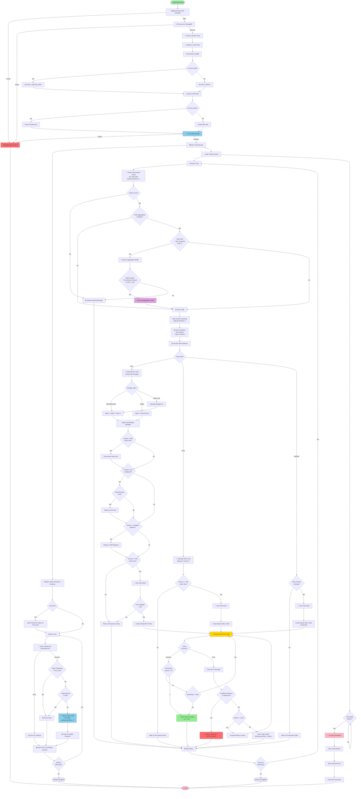

# Polymarket Copy Trading Bot - Complete System Flowchart

## Unified System Flow

```mermaid
flowchart TD
    Start([🚀 Application Start]) --> ValidateEnv[Validate Environment Variables]
    ValidateEnv -->|Invalid| ErrorExit[❌ Display Error & Exit]
    ValidateEnv -->|Valid| ConnectDB[📦 Connect to MongoDB]
    ConnectDB -->|Failed| ErrorExit
    ConnectDB -->|Success| HealthCheck[🏥 Perform Health Check]
    HealthCheck --> InitCLOB[🔐 Initialize CLOB Client]

    InitCLOB --> CreateWallet[Create Ethers Wallet]
    CreateWallet --> CheckGnosis{Is Gnosis Safe?}
    CheckGnosis -->|Yes| SetGnosisSig[Set POLY_GNOSIS_SAFE]
    CheckGnosis -->|No| SetProxySig[Set POLY_PROXY]
    SetGnosisSig --> CreateClient[Create CLOB Client]
    SetProxySig --> CreateClient
    CreateClient --> GetAPIKey{API Key Exists?}
    GetAPIKey -->|Yes| DeriveKey[Derive Existing Key]
    GetAPIKey -->|No| CreateKey[Create New Key]
    DeriveKey --> CLOBReady[✅ CLOB Client Ready]
    CreateKey --> CLOBReady
    CLOBReady -->|Failed| ErrorExit

    CLOBReady -->|Success| StartMonitor[👁️ Start Trade Monitor]
    StartMonitor --> MonitorInit[Initialize: Show DB Stats & Positions]
    MonitorInit --> FirstRun{First Run?}
    FirstRun -->|Yes| MarkHistorical[Mark Historical Trades as Processed]
    FirstRun -->|No| MonitorLoop[Monitor Loop]
    MarkHistorical --> MonitorLoop

    StartMonitor --> StartExecutor[⚡ Start Trade Executor]
    StartExecutor --> ExecutorLoop[Executor Loop]

    MonitorLoop --> FetchTrades[📡 Fetch Trades from Polymarket API]
    FetchTrades -->|Error| LogMonitorError[Log Error & Continue]
    FetchTrades -->|Success| CheckAge{Trade Timestamp<br/>< TOO_OLD?}
    CheckAge -->|Yes| SkipOldTrade[Skip Old Trade]
    CheckAge -->|No| CheckExists{Trade Already<br/>in DB?}
    CheckExists -->|Yes| SkipOldTrade
    CheckExists -->|No| SaveTrade[💾 Save Trade to DB<br/>bot: false<br/>botExecutedTime: 0]
    SaveTrade --> FetchPositions[📊 Fetch & Update Positions]
    FetchPositions --> MonitorWait[⏳ Wait FETCH_INTERVAL seconds]
    SkipOldTrade --> MonitorWait
    LogMonitorError --> MonitorWait
    MonitorWait --> MonitorRunning{Monitor<br/>isRunning?}
    MonitorRunning -->|Yes| MonitorLoop
    MonitorRunning -->|No| MonitorStop([Monitor Stopped])

    ExecutorLoop --> ReadTrades[📖 Read Unprocessed Trades<br/>bot: false AND<br/>botExecutedTime: 0]
    ReadTrades --> HasTrades{Trades Found?}
    HasTrades -->|No| WaitMsg[⏳ Display Waiting Message]
    HasTrades -->|Yes| AggregationEnabled{Trade Aggregation<br/>Enabled?}

    AggregationEnabled -->|No| ProcessTrade[Process Trade]
    AggregationEnabled -->|Yes| CheckTradeSize{Trade Size<br/>< Min Threshold<br/>& BUY?}
    CheckTradeSize -->|Yes| AddBuffer[➕ Add to Aggregation Buffer]
    CheckTradeSize -->|No| ProcessTrade
    AddBuffer --> CheckBufferReady{Buffer Ready?<br/>Time Window Passed<br/>& Total >= Min}
    CheckBufferReady -->|Yes| ProcessAggregated[Process Aggregated Trade]
    CheckBufferReady -->|No| WaitMsg
    ProcessAggregated --> ProcessTrade

    ProcessTrade --> MarkProcessing[Mark Trade Processing<br/>botExecutedTime: 1]
    MarkProcessing --> GetPositions[📊 Fetch Positions:<br/>My Positions<br/>Trader Positions]
    GetPositions --> GetBalance[💰 Get My USDC Balance]
    GetBalance --> DetermineType{Trade Type?}

    DetermineType -->|BUY| CalcBuySize[📐 Calculate BUY Size<br/>Using Copy Strategy]
    DetermineType -->|SELL| CalcSellSize[📐 Calculate SELL Size<br/>Based on Trader %]
    DetermineType -->|MERGE| CheckMergePosition{Have Position<br/>to Merge?}

    CalcBuySize --> GetStrategy{Strategy Type?}
    GetStrategy -->|PERCENTAGE| CalcPercent[Base = Trader × Copy %]
    GetStrategy -->|FIXED| UseFixed[Base = Fixed Amount]
    GetStrategy -->|ADAPTIVE| CalcAdaptive[Calculate Adaptive %]
    CalcAdaptive --> CalcPercent
    UseFixed --> ApplyMultiplier
    CalcPercent --> ApplyMultiplier[Apply Tiered/Single Multiplier]
    ApplyMultiplier --> CheckMax{Amount > Max<br/>Order Size?}
    CheckMax -->|Yes| CapMax[Cap at Max Order Size]
    CheckMax -->|No| CheckPositionLimit{Position Limit<br/>Configured?}
    CheckPositionLimit -->|Yes| CheckPositionSize{Would Exceed<br/>Limit?}
    CheckPositionLimit -->|No| CheckBalanceLimit
    CheckPositionSize -->|Yes| ReducePosition[Reduce to Fit Limit]
    CheckPositionSize -->|No| CheckBalanceLimit{Amount > Available<br/>Balance?}
    ReducePosition --> CheckBalanceLimit
    CheckBalanceLimit -->|Yes| ReduceBalance[Reduce to 99% Balance]
    CheckBalanceLimit -->|No| CheckBuyMin{Amount >= Min<br/>Order Size?}
    ReduceBalance --> CheckBuyMin
    CapMax --> CheckPositionLimit

    CheckBuyMin -->|No| SkipBuy[Mark as Processed & Skip]
    CheckBuyMin -->|Yes| GetOrderBookBuy[📖 Get Order Book]
    GetOrderBookBuy --> CheckSlippage{Price Slippage<br/>< 5¢?}
    CheckSlippage -->|No| SkipBuy
    CheckSlippage -->|Yes| CreateBuyOrder[Create Market BUY Order]

    CalcSellSize --> CheckSellMin{Amount >= Min<br/>Order Size?}
    CheckSellMin -->|No| SkipSell[Mark as Processed & Skip]
    CheckSellMin -->|Yes| GetOrderBookSell[📖 Get Order Book]
    GetOrderBookSell --> CreateSellOrder[Create Market SELL Order]

    CheckMergePosition -->|No| SkipMerge[Mark as Processed & Skip]
    CheckMergePosition -->|Yes| GetOrderBookMerge[📖 Get Order Book]
    GetOrderBookMerge --> CreateMergeOrder[Create Market SELL Order<br/>at Best Bid]

    CreateBuyOrder --> ExecuteOrder[⚡ Execute Order FOK Type]
    CreateSellOrder --> ExecuteOrder
    CreateMergeOrder --> ExecuteOrder

    ExecuteOrder --> OrderResult{Order<br/>Success?}
    OrderResult -->|Success| UpdateRemaining{Remaining<br/>Amount > 0?}
    OrderResult -->|Error| ParseError[Parse Error Message]

    ParseError --> CheckBalanceError{Insufficient Balance<br/>or Allowance?}
    CheckBalanceError -->|Yes| AbortFunds[❌ Abort: Mark with RETRY_LIMIT]
    CheckBalanceError -->|No| RetryCheck{Retries < Limit?}
    RetryCheck -->|Yes| IncrementRetry[Increment Retry Counter]
    IncrementRetry --> ExecuteOrder
    RetryCheck -->|No| MarkFailed[Mark Trade Failed<br/>botExecutedTime = retries]

    UpdateRemaining -->|> 0| CheckRemainingMin{Remaining >= Min?}
    UpdateRemaining -->|0| MarkSuccess[✅ Mark Trade Complete<br/>bot = true]
    CheckRemainingMin -->|Yes| ExecuteOrder
    CheckRemainingMin -->|No| MarkSuccess

    SkipBuy --> ExecutorWait
    SkipSell --> ExecutorWait
    SkipMerge --> ExecutorWait
    AbortFunds --> ExecutorWait
    MarkFailed --> ExecutorWait
    MarkSuccess --> ExecutorWait

    WaitMsg --> ExecutorWait[⏳ Wait 300ms]
    ExecutorWait --> ExecutorRunning{Executor<br/>isRunning?}
    ExecutorRunning -->|Yes| ExecutorLoop
    ExecutorRunning -->|No| ExecutorStop([Executor Stopped])

    StartExecutor --> SignalCheck{SIGTERM/<br/>SIGINT?}
    SignalCheck -->|Yes| Shutdown[🛑 Graceful Shutdown]
    SignalCheck -->|No| SignalCheck
    Shutdown --> StopMonitor[Stop Trade Monitor]
    StopMonitor --> StopExecutor[Stop Trade Executor]
    StopExecutor --> CloseDB[Close DB Connection]
    CloseDB --> Exit([👋 Exit])

    ErrorExit --> Exit
    MonitorStop --> Exit
    ExecutorStop --> Exit

    style Start fill:#90EE90
    style Exit fill:#FFB6C1
    style CLOBReady fill:#87CEEB
    style SaveTrade fill:#87CEEB
    style ExecuteOrder fill:#FFD700
    style MarkSuccess fill:#90EE90
    style AbortFunds fill:#FF6B6B
    style ErrorExit fill:#FF6B6B
    style Shutdown fill:#FFB6C1
    style ProcessAggregated fill:#DDA0DD
```
